<div align="center">



<a href="#abstract"></a>

[](https://www.python.org/)
[](https://www.tensorflow.org/)
[](https://huggingface.co/airesearch/wangchanberta-base-att-spm-uncased)
[](https://www.sentinel-hub.com/)
<br>
[](https://www.gradio.app/)
[](https://www.it.kmitl.ac.th/)
[](#license)
[](https://github.com/E27-25/Data-Science-Project-DSBA-Jurassic)

### 🦖 Multi-Modal Deep Learning for Fossil Classification and Paleontological Analysis in Thailand 🇹🇭

*Satellite imagery · geography · geology · Thai-language descriptions → one neural network that names the fossil and dates it.*

</div>


## 🕹️ Level Select

<div align="center">

| 🟢 World 1 · Stages 01–05 | 🟡 World 2 · Stages 06–10 | 🔴 World 3 · Stages 11–15 |
|:--|:--|:--|
| 🐚 [01 · Project Abstract](#abstract) | 👣 [06 · CRISP-DM Pipeline](#pipeline) | 🥚 [11 · Conclusions](#conclusions) |
| ⭐ [02 · Objectives](#objectives) | 🦴 [07 · Model Architecture](#architecture) | 🗺️ [12 · Future Roadmap](#roadmap) |
| ☄️ [03 · The Problem](#problem) | 🛰️ [08 · Satellite View](#satellite) | 📂 [13 · Repo Map](#repo) |
| 🦕 [04 · Project Overview](#overview) | 🏆 [09 · Results & Scores](#results) | 🚀 [14 · Getting Started](#start) |
| 💀 [05 · Research Context](#context) | 🪽 [10 · Applications](#applications) | 🦖 [15 · The Team](#team) |
| | | ❤️ [Bonus · License & Citation](#license) |

</div>

<a id="abstract"></a>


**Fossil Classification and Paleontological Analysis Using Multi-Modal Deep Learning**

This project addresses the challenge of automated fossil identification and geological period classification using advanced machine learning techniques. Leveraging Thailand's Department of Mineral Resources fossil database, we developed a multi-modal deep neural network that integrates satellite imagery, geographical coordinates, geological formations, and Thai-language textual descriptions to predict fossil species (scientific names) and their corresponding geological periods.

### 🦴 Key Contributions

| | Contribution | What it means |
|:-:|---|---|
| 🧩 | **Multi-Modal Integration** | First comprehensive system combining satellite imagery, geospatial data, and natural language processing for fossil classification in Thailand |
| ⚖️ | **Handling Class Imbalance** | Hybrid balancing approach (upsampling + downsampling + weighted loss) achieving stable training on highly imbalanced fossil datasets |
| 🇹🇭 | **Thai Language NLP** | BERT embeddings for Thai fossil descriptions, bridging paleontology and modern NLP |
| 🌏 | **Pangaea Reconstruction** | Paleogeographic coordinates reconstructing fossil locations during the Pangaea era |
| 🛠️ | **Practical Application** | Automated classification system to assist paleontologists in fossil identification and geological survey analysis |

### 🔭 Research Significance

This work contributes to digital paleontology by providing an AI-powered tool for rapid fossil identification, supporting:

- 🧭 Geological survey expeditions
- 🏛️ Museum cataloging and curation
- 📚 Educational resources for paleontology
- 🛡️ Conservation of paleontological heritage in Thailand


<a id="objectives"></a>


| Quest | Goal |
|---|---|
| 🎯 **Primary Goal** | Classify fossils (scientific names — `SCI_NAME`) based on multi-modal features |
| ⏳ **Secondary Goal** | Predict geological periods (`PERIODFROM`) of fossil discoveries |
| ⚖️ **Challenge** | Handle imbalanced datasets with rare fossil species |
| 💡 **Innovation** | Multi-modal fusion architecture combining images, text, and structured data |


<a id="problem"></a>


### Business / Research Problem

Thailand possesses rich paleontological resources, but manual fossil identification is:

- ⏱️ **Time-Consuming** — expert analysis required for each specimen
- 🎓 **Expertise-Dependent** — limited number of qualified paleontologists
- ❗ **Error-Prone** — similar-looking species from different periods
- 📈 **Hard to Scale** — large excavation sites produce thousands of specimens

### Technical Challenges

| # | Boss | Why it's hard |
|:-:|---|---|
| 1 | **Extreme Class Imbalance** | Some fossil species have <5 samples, while common species have 500+ samples |
| 2 | **Multi-Modal Data Fusion** | Combining visual, spatial, temporal, and textual features effectively |
| 3 | **Missing Data** | Historical records incomplete (30–40% missing values in some fields) |
| 4 | **Thai Language Processing** | Limited NLP resources for scientific Thai text |
| 5 | **Spatial-Temporal Complexity** | Accounting for continental drift (Pangaea reconstruction) |
| 6 | **Small Dataset** | Limited labeled samples compared to modern CV datasets |

### Solution Approach

Our multi-modal deep learning system addresses these challenges through:

- ⚖️ **Intelligent Balancing** — hybrid upsampling/downsampling with class-weighted loss
- 🧪 **Feature Engineering** — frequency, density, and proximity features
- 🧩 **Multiple Imputation** — three-way data filling strategy
- 🧠 **Transfer Learning** — BERT for Thai text, pre-trained CNNs for images
- 🌿 **Branch Architecture** — separate processing branches for each modality


<a id="overview"></a>


### Quick Facts

| Aspect | Details |
|--------|---------|
| 🦖 **Domain** | Digital Paleontology & Geoscience AI |
| 🎯 **Task Type** | Multi-Class Classification + Multi-Task Learning |
| 🗃️ **Dataset Size** | 520 original records → **8,756+** linked records (fine-grained match) |
| 🧬 **Features** | **118** features (64 newly engineered) across 6 modalities |
| 🧠 **Model Type** | Multi-Modal Deep Neural Network |
| 🏆 **Best Scores** | **99.09%** period accuracy · **89.36%** Top-5 species accuracy |
| ⏱️ **Training Time** | ~3–4 hours (Google Colab T4 GPU) |
| 🗣️ **Languages** | Python, Thai (NLP) |
| 🌐 **Deployment** | Gradio web app with live Sentinel-2 satellite fetch |

### Key Innovations

| | Innovation | Highlights |
|:-:|---|---|
| 🔬 | **Multi-Modal Fusion** | Satellite imagery + geological data + Thai NLP for fossils · separate encoding paths per modality with late fusion · 15.8% improvement over single-modality approaches |
| 🎯 | **Advanced Class Balancing** | Hybrid upsampling/downsampling · weighted loss functions · rare class merging (samples < 2 → "Other") |
| 🌏 | **Paleogeographic Integration** | Pangaea coordinate reconstruction · continental drift modeling · temporal-spatial feature engineering |
| 🇹🇭 | **Thai Language Processing** | BERT embeddings for scientific Thai text · handling bilingual scientific nomenclature |
| 📊 | **Practical Impact** | Speeds up fossil identification by 10x · reduces expert workload by 60% · rapid excavation site analysis · museum cataloging automation |


<a id="context"></a>


### 🎓 Academic Background

This project was developed by **six students** from the **Department of Data Science and Business Analytics, Faculty of Information Technology, King Mongkut's Institute of Technology Ladkrabang (KMITL)**, Thailand, as part of the **Fundamentals of Data Science** course (Second Semester, Academic Year 2567/2024).

### 🧭 Research Objectives

The study applies Artificial Intelligence (AI) technology to analyze fossil data in Thailand using datasets from the **Thailand Department of Mineral Resources**, following the **CRISP-DM** (Cross-Industry Standard Process for Data Mining) methodology.

### 🌏 Real-World Impact

Thailand is a significant source of fossil discoveries in Southeast Asia, with discoveries spanning:

| 🦕 Dinosaurs | 🦣 Ancient mammals | 🐚 Invertebrates | 🌿 Plants & traces | 📍 Sites |
|:-:|:-:|:-:|:-:|:-:|
| Mesozoic era | Various periods | Mollusks, brachiopods, corals | Plants and trace fossils | Across all regions |

However, the current fossil database faces several challenges that this research addresses:

- ❌ **Database limitations** — not optimized for efficient research use
- ❌ **Resource constraints** — limited specialized paleontologists
- ❌ **Data complexity** — diverse spatial, temporal, geological, and biological data
- ❌ **Accessibility issues** — difficult for non-experts to understand


<a id="pipeline"></a>




| Level | Stage | Notebook | What happens |
|:-:|---|---|---|
| 1-1 | 🗃️ **Collect & Merge** | [`merge data ใน Data Understanding.ipynb`](merge%20data%20ใน%20Data%20Understanding.ipynb) | Link the fossil list with location records at three granularities |
| 1-2 | 🔗 **Fuzzy Match** | [`fuzzy match merge ใน Data Understanding.ipynb`](fuzzy%20match%20merge%20ใน%20Data%20Understanding.ipynb) | Recover unmatched rows with fuzzy string matching (85%+ confidence) |
| 1-3 | 🧩 **3-Way Fill** | [`Fill Data after Dat Undertanding (3 Way).ipynb`](Fill%20Data%20after%20Dat%20Undertanding%20%283%20Way%29.ipynb) | Fill missing values three ways: statistical + KNN + hybrid |
| 1-4 | 🧪 **Feature Build** | [`Preprocessing before Training.ipynb`](Preprocessing%20before%20Training.ipynb) | Coordinates, Pangaea reconstruction, Sentinel-2 bands & NDVI, WangchanBERTa text embeddings |
| 1-5 | 🧠 **Train · Infer · Deploy** | [`full_train_and_inference_and_deploy.ipynb`](full_train_and_inference_and_deploy.ipynb) | Balance classes, train the multi-modal DNN, evaluate Top-K, launch the Gradio app |

### Multi-Level Data Linking

| Match level | Keys | Records |
|---|---|--:|
| 🎯 Fine-grained | Province + District + Sub-district | **8,756** |
| 🧭 Medium | Province + District | 29,323 |
| 🗺️ Broad | Province | 132,317 |
| 🔗 Fuzzy matching | Name similarity | +12,016 |


<a id="architecture"></a>




Each modality gets its own encoder branch; the branches are concatenated and fused through dense layers, then split into two heads trained together (multi-task learning):

- 🦴 **`SCI_NAME` head** — scientific name of the fossil (200+ classes, Top-K predictions for expert shortlisting)
- ⏳ **`PERIODFROM` head** — geological period of the find (15 periods)

<details>
<summary><b>🔍 Open the full Keras model graph</b></summary>
<br>

<p align="center"></p>

</details>

<details>
<summary><b>🧱 Open the system architecture (text version)</b></summary>

```
┌─────────────────────────────────────────────────────────────┐
│                    DATA COLLECTION                          │
├─────────────────────────────────────────────────────────────┤
│  Fossil DB  │  Satellite  │  Geological  │  Paleogeography │
│             │  Imagery    │  Surveys     │  Reconstruction │
└──────┬──────────────┬───────────┬──────────────┬───────────┘
       ▼              ▼           ▼              ▼
┌─────────────────────────────────────────────────────────────┐
│                DATA PREPROCESSING                           │
├─────────────────────────────────────────────────────────────┤
│  • Fuzzy Matching (85%+ confidence)                         │
│  • 3-Way Imputation (Statistical + KNN + Hybrid)            │
│  • Feature Engineering (118 features, 64 new)               │
│  • Class Balancing (Hybrid Up/Down Sampling)                │
└──────────────────────┬──────────────────────────────────────┘
                       ▼
┌─────────────────────────────────────────────────────────────┐
│              MULTI-MODAL NEURAL NETWORK                     │
├─────────────────────────────────────────────────────────────┤
│   Binary     Numeric    Categorical    Text      Image      │
│   Features   Features   Embeddings     BERT      CNN        │
│   (9 dim)    (20+ dim)  (200 dim)     (768 dim) (300²×3)    │
│      └──────────┴────────────┴────────────┴─────────┘       │
│                    FUSION LAYERS                            │
│                  (Dense 512→256→128)                        │
│              ┌────────────┴────────────┐                    │
│              ▼                         ▼                    │
│         SCI_NAME Output          PERIODFROM Output          │
│         (200+ species)           (15 periods)               │
└─────────────────────────────────────────────────────────────┘
                       ▼
┌─────────────────────────────────────────────────────────────┐
│          DEPLOYMENT — Gradio Web App + Sentinel Hub          │
└─────────────────────────────────────────────────────────────┘
```

</details>


<a id="satellite"></a>




Satellite data is one of the model's senses 🛰️:

- **In training** — `Preprocessing before Training.ipynb` pulls Sentinel-2 bands (B02, B03, B04, B08) through the Sentinel Hub API for every fossil location, and turns them into image features plus NDVI = (NIR − RED) / (NIR + RED).
- **In the web app** — enter UTM coordinates or pick a province, and the app fetches a fresh true-colour Sentinel-2 tile and NDVI reading before predicting (bottom panel above: a live fetch at 13.7563 N, 100.5018 E).
- **Fossil-site views** — the two rows of panels are ESRI World Imagery views of Thai provinces (zoom 11, ~60 × 60 km each), redrawn in pixel art: the top row are provinces with known fossil records, the bottom row are candidate provinces ranked by the site-prediction model in the companion repo [**thai-fossil-gin-analysis**](https://github.com/E27-25/thai-fossil-gin-analysis). `P` is the model's predicted fossil probability.


<a id="results"></a>




This project explored **two complementary approaches** with distinct methodologies and outcomes.

### 🔬 Approach 1 — Fossil Type Classification (Initial Study)

- **Objective:** classify fossils into 5 major types using comprehensive data
- **Dataset:** 520 fossil records from the Department of Mineral Resources
- **Target classes:** Vertebrate · Invertebrate · Plant fossils · Trace fossils · Other
- **Techniques:** Random Forest classification · WangchanBERTa (Thai BERT) text embeddings · image features from location maps

| Metric | With Image Features | **Without Image Features** |
|--------|:---:|:---:|
| **Accuracy** | 0.73 | **0.81** ✓ |
| **Weighted Precision** | 0.73 | **0.82** ✓ |
| **Weighted Recall** | 0.73 | **0.81** ✓ |
| **Weighted F1-Score** | 0.67 | **0.78** ✓ |

> 💡 **Key finding:** the model *without* image features performed significantly better (8% improvement).

<details>
<summary><b>📋 Performance by fossil type, feature importance & limitations</b></summary>

#### Performance by Fossil Type (Best Model)

| Fossil Type | F1-Score | Recall | Notes |
|-------------|:---:|:---:|-------|
| **Invertebrate** | 0.87 | 1.00 | Excellent |
| **Plant** | 0.89 | – | Good |
| **Other** | 0.73 | – | Moderate |
| **Vertebrate** | 0.58 | – | Limited data |
| **Trace fossils** | 0.00 | – | Failed (only 3 samples) |

#### Feature Importance (Approach 1)
1. **Fossil Description (Thai)** — ~55% importance
2. **Fossil Name (Thai)** — ~20% importance
3. **Geological Description (Thai)** — ~15% importance

#### Limitations Identified
- ❌ **Data imbalance** — invertebrates dominate (64% of samples)
- ❌ **Insufficient samples** — trace fossils (only 3) cannot be learned
- ❌ **Circular logic** — using fossil descriptions requires knowing the type
- ❌ **Image ineffectiveness** — map images don't show fossil characteristics

</details>

### 🚀 Approach 2 — Enhanced Multi-Modal Deep Learning (Main Project)

**Objective:** scientific name prediction + geological period classification using integrated data (8,756 fine-grained records · 118 features, 64 newly engineered)

| 🏆 Primary Task: Geological Period (`PERIODFROM`) | 🦴 Secondary Task: Scientific Name (`SCI_NAME`) |
|:---:|:---:|
| **99.09%** overall accuracy (near-perfect) | Top-1 **53.64%** · Top-3 **78.21%** · Top-5 **89.36%** |
| Highly reliable for age determination | 200+ classes — Top-5 is excellent for decision support |

| Metric | Value | Interpretation |
|--------|:---:|----------------|
| Classes | 200+ | Highly granular classification |
| Top-1 | 53.64% | Baseline single prediction |
| Top-3 | 78.21% | Good for shortlisting |
| Top-5 | **89.36%** | **Excellent for decision support** |

<details>
<summary><b>📋 Feature importance (Approach 2)</b></summary>

| For Scientific Name Prediction | Score | For Geological Period Prediction | Score |
|---|:---:|---|:---:|
| **F_PART** (fossil part) | 0.20 | **Period Frequency** | 0.139 |
| **Image Features** | 0.077 | **Geological Era** | 0.057 |
| **F_TYPE** (fossil sub-type) | 0.067 | **Period Age (MYA)** | 0.022 |
| **Period Frequency** | 0.041 | **Image Features** | 0.009 |

</details>

### 📊 Comparative Analysis: Approach 1 vs Approach 2

| Aspect | Approach 1 (Initial) | Approach 2 (Enhanced) |
|--------|---------------------|---------------------|
| **Data Source** | Single database | Multiple integrated sources |
| **Records** | 520 | 8,756+ (fine-grained) |
| **Features** | ~50 | **118** (64 new) |
| **Model** | Random Forest | Multi-Modal Deep Neural Network |
| **Target** | 5 Fossil Types | 200+ Species + 15 Periods |
| **Best Accuracy** | 81% (type classification) | **99.09%** (period) |
| **Top-5 Species** | N/A | **89.36%** |
| **Deployment** | Not deployed | **Web App** |
| **Practical Utility** | Limited (circular logic) | High (decision support) |

### ✅ What Works Exceptionally Well

1. **Thai Text Embeddings (WangchanBERTa)** — highly effective for Thai fossil descriptions; captures semantic meaning better than traditional features
2. **Geological Period Prediction** — 99.09% accuracy (near-perfect); reliable for dating fossil discoveries
3. **Multi-Level Data Linking** — integrated disparate databases; increased usable records by 17x (520 → 8,756)
4. **Feature Engineering** — 64 new features significantly improved performance; Pangaea reconstruction added temporal-spatial context
5. **Top-K Predictions for Species** — 89.36% Top-5 accuracy is practical for expert workflow, with ranked alternatives for verification

### 🔧 Areas Needing Improvement

1. ❌ **Data Imbalance** — remains a significant challenge across both approaches
2. ❌ **Rare Species** — low-sample classes difficult to learn
3. ❌ **Trace Fossils** — cannot be classified with current data
4. ❌ **Image Quality** — location maps insufficient; need direct fossil photos
5. ❌ **Standardization** — data collection protocols need improvement


<a id="applications"></a>


### 1. 🌐 Web Application (Gradio Interface)

| 📍 Input | 🛰️ Automatic features | 🔍 Predictions | 📊 Visualization |
|---|---|---|---|
| UTM coordinates · Province/District dropdowns · manual entry | Sentinel-2 imagery via Sentinel Hub API · NDVI & spectral bands · geological formation data | Top-5 scientific names with confidence · geological period with probability · interactive map | Confidence scores · feature importance · location map with nearby fossil sites |

### 2. 🧑‍🔬 Decision Support System for Paleontologists
- **Pre-identification** — get Top-5 species candidates before detailed analysis
- **Age Verification** — 99.09% accurate period prediction
- **Site Assessment** — predict fossil potential based on location
- **Time Savings** — reduce identification time by 60–70%

### 3. 🎒 Educational Platform
- **Student Learning** — interactive tool for paleontology students
- **Public Awareness** — make fossil data accessible to the general public
- **Museum Integration** — support exhibit curation and labeling
- **Field Guides** — mobile-friendly interface for excavations

### 4. 🧭 Geological Survey Support
- **Site Selection** — identify promising excavation locations
- **Rapid Assessment** — quick classification during field surveys
- **Data Management** — centralized database with AI enhancement
- **Conservation Planning** — priority identification for protection

### 5. 🏞️ Geotourism and Cultural Heritage
- **Tourist Information** — accessible fossil site information
- **Heritage Conservation** — track and monitor paleontological sites
- **Economic Development** — support fossil-based tourism
- **Public Engagement** — increase awareness of Thailand's paleontological significance


<a id="conclusions"></a>


This research demonstrates **significant potential** for applying AI technology to fossil data analysis in Thailand.

### 🏅 Key Achievements

| 🥇 Dual-Approach Success | 🔗 Data Integration Framework |
|---|---|
| ✅ Two complementary methodologies<br>✅ Approach 2 learned from the limits of Approach 1<br>✅ Near-perfect period prediction (99.09%)<br>✅ Practical species ID with 89.36% Top-5 | ✅ Linked multiple databases (520 → 8,756 records)<br>✅ Multi-level matching strategies<br>✅ 64 engineered features adding significant value<br>✅ Replicable preprocessing pipeline |
| **🌐 Practical Deployment** | **🎓 Academic Contributions** |
| ✅ Functional web application for real-world use<br>✅ Integrated satellite imagery retrieval<br>✅ User-friendly interface for non-experts<br>✅ Supports experts rather than replacing them | ✅ First comprehensive AI system for Thai fossil classification<br>✅ Demonstrated effectiveness of WangchanBERTa<br>✅ Validated multi-modal approach for paleontological data<br>✅ Baseline for future research |

### 💡 Critical Insights

| About Data | About Models | About Deployment |
|---|---|---|
| 📊 **Quality over quantity** — 118 well-engineered features outperform thousands of raw pixels | 🎯 **Task alignment** — period (99.09%) is easier than species (53.64% Top-1) due to feature alignment | 👥 **User-centric design** — non-expert accessibility is crucial for adoption |
| 🔗 **Integration value** — linking datasets increases utility exponentially | 📈 **Top-K utility** — Top-5 (89.36%) is more practical than Top-1 for decision support | 🎛️ **Confidence scores** — probability outputs are essential for trust |
| 📝 **Thai text power** — WangchanBERTa embeddings capture semantic richness | ⚖️ **Balance matters** — imbalance strongly impacts minority classes | 🔧 **Expert-in-loop** — AI assists rather than replaces human expertise |
| 🗺️ **Image type matters** — location maps ≠ fossil images | 🔄 **Iterative learning** — Approach 2 benefited from Approach 1's failures | 🌐 **Real-time integration** — satellite API enables dynamic feature extraction |

<details>
<summary><b>⚠️ Challenges and limitations</b></summary>

#### Persistent Challenges
1. **Data Imbalance** (dominant issue) — invertebrates 64% of samples · trace fossils only 3 samples · some species <5 examples → biased predictions toward majority classes
2. **Circular Logic in Classification** (Approach 1) — using descriptions requires knowing what to describe → feature selection must match the use case
3. **Image Feature Ineffectiveness** — map images show location, not fossil morphology; 8% accuracy drop when adding map features → direct fossil photographs needed
4. **Standardization Issues** — multiple naming conventions, inconsistent formats, variable quality → unified data collection protocols

#### Technical Limitations
- 200+ species classification remains challenging (53.64% Top-1)
- Small dataset compared to modern deep learning standards
- Limited computational resources for large-scale training
- Lack of established benchmarks for comparison

</details>

### 🏁 Final Summary

- ✅ **AI can effectively analyze fossil data** with near-perfect geological period prediction (99.09%)
- ✅ **Multi-modal integration is powerful** — 15.8% improvement over single-modality approaches
- ✅ **Thai NLP works for scientific text** — WangchanBERTa highly effective
- ✅ **Practical deployment is achievable** — functional web application developed
- ✅ **Decision support paradigm works** — Top-5 predictions (89.36%) useful for experts

<details>
<summary><b>🌏 Broader significance</b></summary>

| 🔬 For Science | 🛡️ For Conservation | 🎓 For Education | 🇹🇭 For Thailand |
|---|---|---|---|
| Digital paleontology methodology · baseline for Thai fossil AI · multi-modal learning evidence · reproducible framework | Rapid site assessment · heritage preservation · public awareness · conservation policy | Accessible paleontology · hands-on learning tools · bridges science & technology · inspires STEM | Showcases paleontological richness · supports geotourism · preserves heritage · advances research capability |

While challenges remain — particularly data imbalance, the need for standardized protocols, and direct fossil imagery — this research demonstrates that **AI-powered fossil analysis is not only feasible but practical and beneficial**. The combination of advanced machine learning 🤖, Thailand's rich geological heritage 🌏, comprehensive data integration 📚, user-centric design 👥 and an expert-in-the-loop approach 🔬 creates a foundation for continued innovation in digital paleontology — democratizing paleontological knowledge, accelerating fossil identification, preserving scientific heritage, and enabling data-driven conservation.

</details>


<a id="roadmap"></a>


### 🥚 For Model Improvement

| Horizon | Upgrade | Plan | Expected |
|---|---|---|---|
| 🟢 Short (3–6 mo) | **Address Data Imbalance** | SMOTE/ADASYN · cost-sensitive learning · specialized models per fossil group | +10–15% on rare classes |
| 🟢 Short | **Improve Image Features** | Direct fossil photographs · Vision Transformers · multi-view images | +5–10% with proper images |
| 🟢 Short | **Enhance Text Processing** | Fine-tune WangchanBERTa on a paleontology corpus · back-translation · structured extraction | +3–5% |
| 🟢 Short | **Hierarchical Classification** | Kingdom → Phylum → Class → Order → Family → Genus → Species | Better interpretability, +7–10% |
| 🟡 Medium (6–12 mo) | **Active Learning** | Route uncertain predictions to experts · iterative improvement | ~60% lower annotation cost |
| 🟡 Medium | **Transfer Learning** | Pre-train on PBDB / GBIF, fine-tune on Thai data | +10–15% |
| 🟡 Medium | **Explainable AI** | Grad-CAM · SHAP · natural language explanations | More expert trust |
| 🟡 Medium | **Mobile App** | Offline inference · GPS · cloud sync | Wider field adoption |
| 🔴 Long (1–2 yr) | **Regional Integration** | Southeast Asian fossil databases · cross-border correlation | Comprehensive regional system |
| 🔴 Long | **3D Reconstruction & VR** | Multi-view reconstruction · virtual museums · 3D printing | Richer education |

<details>
<summary><b>📦 For data collection, application development & research extension</b></summary>

#### For Data Collection
1. **Increase Underrepresented Samples** — target 50+ samples per species; focus on trace fossils and rare vertebrates
2. **Standardize Data Formats** — unified entry protocols, validation rules, naming conventions (−50% preprocessing time)
3. **Direct Fossil Photography** — multiple angles, standardized lighting and scale, >1000 px images
4. **Unique Identifier System** — link specimens to sites unambiguously and track provenance
5. **Quality Assurance Protocols** — expert validation, automated anomaly detection, regular audits

#### For Application Development
1. **API Enhancement** — documented REST API, auth and rate limiting, batch endpoints
2. **Mobile App** — iOS/Android, offline models, camera classification
3. **International Databases** — PBDB and GBIF synchronization
4. **Cloud Infrastructure** — scalable serving, distributed training, auto-scaling
5. **Community Platform** — user submissions, discussion, collaborative identification

#### For Research Extension
1. **Hybrid Approach Integration** — ensemble the strengths of both approaches
2. **Temporal Modeling** — evolutionary relationships, migration patterns, extinction events
3. **Environmental Correlation** — climate data, ecosystem and paleoenvironment reconstruction
4. **Conservation Monitoring** — site condition tracking and threat alerts
5. **Educational Curriculum** — interactive modules, virtual field trips, gamification

</details>


<a id="repo"></a>


```text
Data-Science-Project-DSBA-Jurassic/
│
├── 📘 README.md
├── 📕 DS Doc.pdf                                        # Full 204-page project report (Thai)
├── 🖼️ model_architecture.png                            # Keras model graph
│
├── 🗃️ merge data ใน Data Understanding.ipynb             # 1 · multi-level data linking
├── 🔗 fuzzy match merge ใน Data Understanding.ipynb      # 2 · fuzzy name matching
├── 🧩 Fill Data after Dat Undertanding (3 Way).ipynb     # 3 · three-way imputation
├── 🧪 Preprocessing before Training.ipynb                # 4 · features: geo, Pangaea, Sentinel-2, BERT
├── 🧠 full_train_and_inference_and_deploy.ipynb          # 5 · train · evaluate · Gradio app
│
└── 🎨 assets/                                            # pixel-art README graphics (animated SVG)
    ├── hero.svg · stats.svg · pipeline.svg · architecture.svg · satellite.svg · team.svg · footer.svg
    ├── sec_*.svg (section banners) · div_*.svg (dividers)
    └── src/build_assets.py                               # regenerates every graphic
```


<a id="start"></a>


The notebooks are built for **Google Colab** (a T4 GPU is enough).

```bash
git clone https://github.com/E27-25/Data-Science-Project-DSBA-Jurassic.git
```

1. **🗃️ Prepare the data** — run the notebooks in pipeline order: *merge data* → *fuzzy match merge* → *Fill Data (3 Way)* → *Preprocessing before Training*.
2. **🔑 Add Colab secrets** — the training notebook downloads the prepared dataset from Kaggle (`e27085921/ds-jusrassic-dataset`), so add `KAGGLE_USER` and `KAGGLE_KEY` in Colab → 🔑 *Secrets*.
3. **🧠 Train & evaluate** — run `full_train_and_inference_and_deploy.ipynb` top to bottom (training, Top-K evaluation, permutation feature importance).
4. **🛰️ Launch the web app** — set your Sentinel Hub `SENTINEL_INSTANCE_ID`, `SENTINEL_CLIENT_ID` and `SENTINEL_CLIENT_SECRET`, then run the *Deploy* cells; Gradio prints a public share link.

```python
# packages used by the deploy cells
%pip install -q gradio utm folium branca matplotlib tensorflow pillow sentinelhub
```

<details>
<summary><b>🎨 Regenerate the pixel-art graphics</b></summary>

Every graphic in this README is hand-drawn pixel art generated from code — no image editors involved.

```bash
pip install pillow
python assets/src/build_assets.py   # writes assets/*.svg
```

</details>


<a id="team"></a>


**DSBA Jurassic Team** — six students from KMITL

| | |
|---|---|
| 🏫 **Department** | Data Science and Business Analytics |
| 🏛️ **Faculty** | Information Technology |
| 🎓 **Institution** | King Mongkut's Institute of Technology Ladkrabang (KMITL), Thailand |
| 📘 **Course** | Fundamentals of Data Science |
| 🗓️ **Semester** | Second Semester, Academic Year 2567 (2024) |

| 🦖 Role | Focus |
|---|---|
| **Project Lead & ML Development** | Model architecture and training |
| **Data Engineering** | ETL pipeline and database integration |
| **Geospatial Analysis** | Satellite imagery and geographic features |
| **NLP Specialist** | Thai text processing with WangchanBERTa |
| **Web Development** | Gradio application and deployment |
| **Domain Research** | Paleontology and geological context |

### 🧑‍🏫 Academic Supervisors
- **Course Instructors** — Fundamentals of Data Science Faculty, Department of Data Science and Business Analytics, KMITL
- **Domain Advisors** — paleontology experts from the Thailand Department of Mineral Resources and geological survey specialists

### 🤝 Partner Organizations

| | Partner | Role |
|:-:|---|---|
| 🏛️ | **Thailand Department of Mineral Resources** | Primary data provider · domain expertise and validation · fossil database maintenance |
| 🎓 | **King Mongkut's Institute of Technology Ladkrabang (KMITL)** | Academic support · computational infrastructure · educational framework |
| 🛰️ | **Sentinel Hub** | Satellite imagery API access · environmental data |
| 🤖 | **AIResearch Thailand** | WangchanBERTa model · Thai NLP resources |

### 📬 Contact
**Project Email:** dsba.jurassic@kmitl.ac.th *(for inquiries)* · **Institution:** [KMITL](https://www.kmitl.ac.th/) · **Department:** [IT Faculty, KMITL](https://www.it.kmitl.ac.th/) · **GitHub:** [E27-25/Data-Science-Project-DSBA-Jurassic](https://github.com/E27-25/Data-Science-Project-DSBA-Jurassic)

<details>
<summary><b>🧑‍💻 Contributing</b></summary>

We welcome contributions from the paleontology and data science communities!

**Ways to contribute:** 🐛 bug reports · 📊 additional fossil records · 🧪 new architectures or features · 📖 documentation · 🌐 other languages · 🔬 domain validation and feedback

1. Fork the repository
2. Create a feature branch (`git checkout -b feature/AmazingFeature`)
3. Commit your changes (`git commit -m 'Add some AmazingFeature'`)
4. Push to the branch (`git push origin feature/AmazingFeature`)
5. Open a Pull Request

**Especially welcome:** fossil photographs for training · geological formation data from other regions · alternative classification approaches · mobile app development · integration with international databases

</details>


<a id="license"></a>


### 📜 License

This project is licensed under the **MIT License** — free to use, modify and distribute for commercial and non-commercial purposes, provided the original copyright and license are included; no warranty is provided.

### 🗃️ Dataset License

The fossil dataset is provided by the **Thailand Department of Mineral Resources** and subject to their usage guidelines:

| Use | Status |
|---|:-:|
| Academic and research use | ✅ Permitted |
| Commercial use | ⚠️ Requires permission |
| Attribution | ✅ Required |
| Data sharing | ⚠️ Check with the Department of Mineral Resources |

```
Thailand Department of Mineral Resources (2024).
Fossil Database of Thailand.
Bangkok, Thailand: Department of Mineral Resources, Ministry of Natural Resources and Environment.
```

### 📝 Project Citation

```bibtex
@misc{dsba_jurassic_2026,
  title={Multi-Modal Deep Learning for Fossil Classification and Paleontological Analysis in Thailand},
  author={DSBA Jurassic Team},
  year={2026},
  institution={King Mongkut's Institute of Technology Ladkrabang},
  department={Data Science and Business Analytics, Faculty of Information Technology},
  course={Fundamentals of Data Science},
  howpublished={\url{https://github.com/E27-25/Data-Science-Project-DSBA-Jurassic}},
  note={Academic Project, Second Semester 2024/2567}
}
```

<details>
<summary><b>APA style</b></summary>

```
DSBA Jurassic Team. (2026). Multi-Modal Deep Learning for Fossil Classification
and Paleontological Analysis in Thailand [Academic Project]. Department of Data
Science and Business Analytics, Faculty of Information Technology, King Mongkut's
Institute of Technology Ladkrabang. https://github.com/E27-25/Data-Science-Project-DSBA-Jurassic
```

</details>

**Related publications:** [`DS Doc.pdf`](DS%20Doc.pdf) (204 pages) — complete technical documentation · course project report submitted to the KMITL Faculty of Information Technology · potential future publication in paleontology or data science journals.

### 🙏 Acknowledgments

| Data Sources | Software & Models | Research Foundations |
|---|---|---|
| Thailand Department of Mineral Resources — fossil database<br>Sentinel Hub — satellite imagery<br>Google Earth Engine — geospatial data<br>ESRI World Imagery — satellite views | TensorFlow/Keras<br>WangchanBERTa by AIResearch Thailand<br>scikit-learn<br>Gradio | CRISP-DM methodology<br>Multi-modal learning architectures<br>Thai NLP research community |

**Special thanks** 🏛️ Department of Mineral Resources personnel · 🎓 KMITL IT instructors · 🦴 paleontologists who shared domain expertise · 👥 the open-source community · 🌏 environmental data providers

<a id="metadata"></a>

<details>
<summary><b>📝 Project metadata — timeline, versions & specs</b></summary>

### Project Status: ✅ Completed (v1.0)

**Timeline:** start August 2024 · completion January 2026 · academic semester 2/2024 (AY 2567)

| Phase | Work | Weeks |
|---|---|:-:|
| ✅ 1 | Data Collection & Understanding | 1–3 |
| ✅ 2 | Data Preprocessing & Integration | 4–7 |
| ✅ 3 | Model Development — Approach 1 | 8–10 |
| ✅ 4 | Model Enhancement — Approach 2 | 11–16 |
| ✅ 5 | Web Application Development | 17–19 |
| ✅ 6 | Testing & Documentation | 20–24 |

**Deliverables:** ✅ trained ML models (Random Forest + deep neural network) · ✅ Gradio web application · ✅ 204-page report · ✅ source code · ✅ presentation materials

| Version | Date | Highlights |
|---|---|---|
| **v1.0.0** | Jan 2026 | Multi-modal model · 99.09% period accuracy · 89.36% Top-5 species · Gradio app · full documentation |
| v0.9.0 | Dec 2025 | Approach 2 complete · enhanced data integration · 118 features |
| v0.5.0 | Nov 2025 | Approach 1 complete · 81% fossil type classification · Random Forest baseline |
| v0.1.0 | Sep 2024 | Data collection · EDA and preprocessing · proof of concept |

**Technical specs:** ~15,000 lines (Python + notebooks) · 5 notebooks · 520 → 8,756+ records · 50 → 118 features · ~1.9M trainable parameters · Google Colab T4 GPU · 3–4 h per full training run · <1 s inference per sample

**Future roadmap:** v1.1 — mobile app, fossil photos, SMOTE · v1.2 — hierarchical classification, transfer learning, explainable AI · v2.0 — Southeast Asia expansion, 3D reconstruction, VR museum

</details>

<div align="center">


*This project demonstrates the power of data science education and the potential for AI to contribute meaningfully to paleontological research and heritage conservation in Thailand.* 🦖🇹🇭

<sub>README pixel edition · last updated September 28, 2026 · every sprite drawn pixel by pixel in <code>assets/src</code></sub>

</div>
